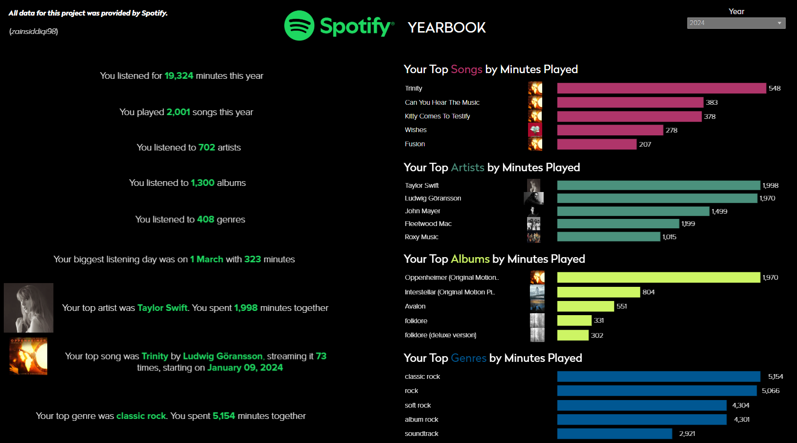

## Background and Overview

This is an analytics engineering project where I use my [Spotify](https://spotify.com) data to create a dashboard that visualises my listening habits for each year. This project was inspired by Spotify Wrapped and how I think the product has been lackluster in 2024. I [request my data from Spotify](https://www.spotify.com/uk/account/privacy/), which comes back as `JSON` files. I use [dltHub](https://dlthub.com) to then create a pipeline to extract track, artist, and album details from the [Spotify API](https://developer.spotify.com/documentation/web-api/tutorials/getting-started). I use [duckdb](https://duckdb.org/) to store the data locally and [dbt](https://getdbt.com/) to transform the data into a `STAR Schema`. I then feed this data into [Tableau](https://www.tableau.com/) to create the 🔗[dashboard](https://public.tableau.com/views/SpotifyYearbook/Yearbook).

### Tech Stack

`Python`
`SQL`
`dbt`
`dltHub`
`duckdb`
`Tableau`

## Insights



The dashboard is split into 2 distinct sections to give

1. `Insights at a glance`, on the left hand side of the dashboard. These are 1-liners that give you an overview of your listening habits related to tracks, artists, albums, and genres. This is a quick way to see what you've been listening to the most, and is used by Spotify Wrapped to give you a quick overview of your listening habits.
2. `Detailed insights`, on the right hand side of the dashboard. This is a more detailed look at your listening habits, with a focus on the top tracks, artists, and albums you've listened to, as well as the genres you've been listening to. This is a more detailed look at your listening habits, and is used by Spotify Wrapped to give you a more detailed look at your listening habits.

You can also see a filter on the dashboard that allows you to filter by year, so you can see how your listening habits have changed over time.

## Replicating the Project

1. Request your `extended streaming history` data from Spotify
2. Clone this repository to your local PC
3. Follow the instructions on [creating an app](https://developer.spotify.com/documentation/web-api/tutorials/getting-started) to use the Spotify API, get your `client_id` and `client_secret` and store these in a `.env` file in the root directory of the project as 

```
SPOTIFY_CLIENT_ID="your_client_id"
SPOTIFY_CLIENT_SECRET="your_client_secret"
```
4. Create a virtual environment by running `python -m venv venv` in the root directory of the project
5. Activate the virtual environment by running `source venv/bin/activate` on MacOS/Linux or `venv\Scripts\activate` on Windows
6. Install the necessary packages by running `pip install -r requirements.txt`
7. Run the `spotify_extract_load.py` file by running `python spotify_extract_load.py` to extract the data from the `JSON` files and load it into a `duckdb` database
8. Once the pipeline is run, navigate to the `spotify_transform` directory and run `dbt run` to transform the data into a `STAR Schema`
9. Once this is complete, run `dbt test` to ensure the data is correct
10. Now save the files locally by running `save_local.py` in the root directory. This will save files for all layers of the data transformation process. We need the files from the `data/mart` directory
11. Open the `Spotify Yearbook.twbx` file in Tableau Public and connect to the files in the `data/mart` directory. You will need to refresh the data source to ensure the data is up to date
12. The Tableau dashboard should now be populated with your data!